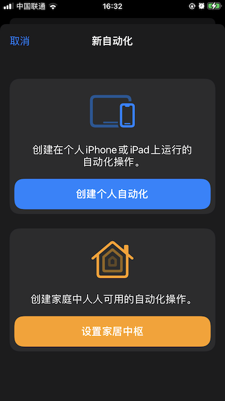
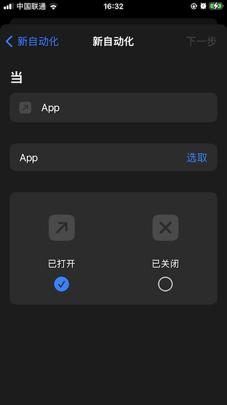
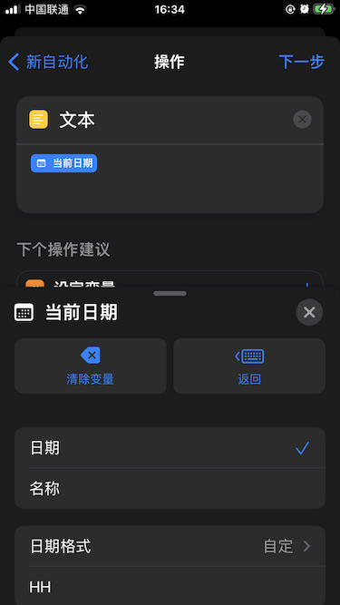
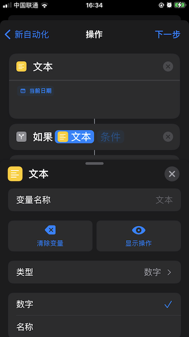
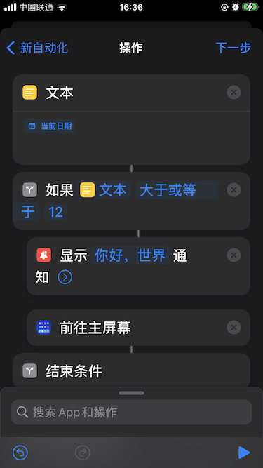
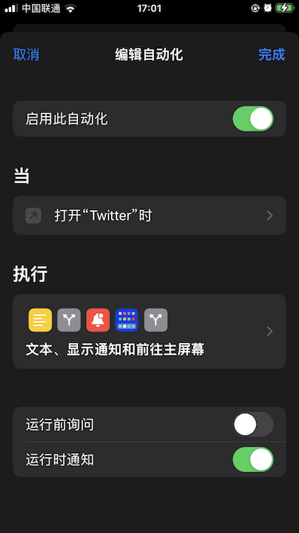

# ARTS 20200806

## Algorithm

## Review

## Tips

## Share

1. 选择 “创建个人自动化”。  

2. 选取需要控制的 App。  

3. 新增 “文本” 操作（所有操作可搜索找到，下同），选择变量 “当前日期”。日期格式选 “自定”，“HH” 表示当前日期的 “小时”。  

4. 新增 “如果” 操作，“文本” 为上一步生成的变量，类型选 “数字”。  

5. 条件选 “大于等于 12”，即 “时间大于每天的12点”。
6. 新增 “通知” 操作，可以自定义通知的文案。
7. 新增 “前往主屏幕” 操作。
8. 把 “通知” 和 “前往主屏幕” 两个操作长按拖动到 “如果” 操作里。  

9. 最后，关闭此自动化的 “运行前询问”。即可实现每天12点以后打开某 App，自动提示并退回到主屏幕。  

